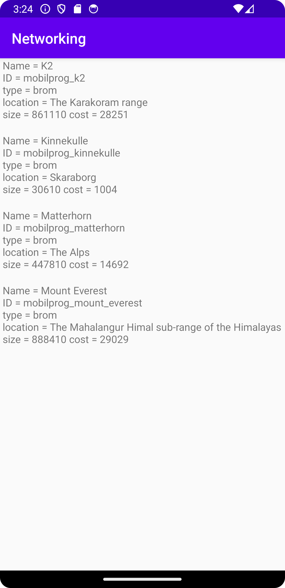

# Rapport
Gjorde en class genom java > new > Java Class. Denna kallas för Mountain. Jag gav även classen variabler som vi ska använda senare. 
Skapade även getters och setters för att kunna manipulera objektens/classens data. Observera att denna klass i slutskedet inte används, 
då den har ersätts av en RecyclerViewItem class.

Skapade en ArrayList där jag lätter in mountain objects, och ger dem ett namn. Detta aktiverar den constructor som bara tar in värdet name.
Jag sätter även in 3 stycken mountains (och skapar dem) genom ArrayListen. Notera att i Senare skeden kommer denna data ej synas, pga metoden
.clear(), som används för att rensa de värden som finns i listan, innan vi sätter in nya värden.
```
ArrayList <Mountain> mountains = new ArrayList<>(Arrays.asList(
new Mountain("mountain1"),
new Mountain("mountain2"),
new Mountain("mountain3")));

        for(int i=0; i<mountains.size(); i++) {
            Log.d("potato", mountains.get(i).toString());
```
Skapade även en recyclerView genom kodraden nedan.
```
<androidx.recyclerview.widget.RecyclerView
android:id="@+id/recycler_view"
android:layout_width="match_parent"
android:layout_height="match_parent"
app:layout_constraintBottom_toBottomOf="parent"
app:layout_constraintLeft_toLeftOf="parent"
app:layout_constraintRight_toRightOf="parent"
app:layout_constraintTop_toTopOf="parent" />
```
Skapade en recyclerviewitem genom layout > new > Layout Resource File. Denna gjordes till en Linear Layout. I denna skapade jag även en TextView.
Notera att det är en xml fil, där vi slänger in en textview.
```
    <TextView
        android:layout_width="match_parent"
        android:layout_height="wrap_content"
        android:id="@+id/TextViewRecyclerThing"
        />
```
Därefter skapade vi en till class, RecyclerViewAdapter. I denna implementerade den kod som finns på canvas.
```
@NonNull
@Override
public RecyclerViewAdapter.ViewHolder onCreateViewHolder(@NonNull ViewGroup parent, int viewType) {
return null;
}
    @Override
    public void onBindViewHolder(@NonNull RecyclerViewAdapter.ViewHolder holder, int position) {
    }
    @Override
    public int getItemCount() {
        return 0;
    }
```
Skapade en RecyclerViewItem klass, och bytte till RecyclerViewItem i de kodrader som tidigare matchat mountains i MainActivity. Notera att tidigare 
kod i MainActivity redan fanns när projectet forkats. Lade även till en recyclerView i MainActivity, som vi namngett view. Denna sätter vi till den 
recycler view vi skapat i activity_main.xml, vi sätter även view till en "Linear Layout", samt att vi sätter adaptern på view.
```
RecyclerView view = findViewById(R.id.recycler_view);
view.setLayoutManager(new LinearLayoutManager(this));
view.setAdapter(adapter);
```
Efter fel som innebar att appen krashar hittar vi felet i RecyclerViewAdapter, där "TextViewRecyclerThing" innan innehöll "title", vilket
innebar att vi sätter in en "null" textview, vilket krashade appen. "TextViewRecyclerThing" kom ifrån recyclerviewitem.xml då genom
android:id="@+id/TextViewRecyclerThing".
```
ViewHolder(View itemView) {
...
...
title = itemView.findViewById(R.id.TextViewRecyclerThing);
}
```
La in given URL i kodraden nedan, vilket get oss möjlighet att executea en URL som används för data,
```
private final String JSON_URL = "https://mobprog.webug.se/json-api?login=brom";
```
-> Vilket ger oss en URL att arbeta ifrån. Därefter implementerar vi given kod ifrån canvas, vilken unmarshallear
JSON till en lista med objekt. Detta sker i onPostExecute.
```
  public void onPostExecute(String json) {
       ...
        Type type = new TypeToken<ArrayList<RecyclerViewItem>>(){}.getType();
        ArrayList<RecyclerViewItem> listOfMountains = gson.fromJson(json, type);
    }
```
La till en JsonTask för MainActivity, som executear JSON_URL.
```
new JsonTask(this).execute(JSON_URL);
```
Fixade även UpdateData, vilket tar in RecyclerViewItem och gör det till en RecyclerItemList,
vi tar bort allting ifrån items, fyller på med datan ifrån newRecyclerItemList, och notifierar att 
datan har uppdaterats, och tidigare data på sidan har "bytts ut". Notera att om clear metoden inte funnits, hade vi 
sätt de äldre värderna innan de nyare.
```
    public void UpdateData(ArrayList<RecyclerViewItem> newRecyclerItemList) {
        items.clear();
        items.addAll(newRecyclerItemList);
        notifyDataSetChanged();
    }
```
Efter problem med att visa upp data i MainActivity, ändrade jag om och rensade metoder som inte användes, bland annat flyttade jag
ner JsonTask till längre ner i oncreate, efter recyclerViewAdapterns "skapelse" . Efter detta lade jag även till metoden serializedName, 
i RecyclerViewItems, för att "registrera" title som name, så att JSON datan kan länkas på ett riktigt sätt.
```
 @SerializedName("name")
 private String title;
```

Lade till variabler i RecyclerViewItem, som ska användas för att skriva ut ytterligare data. I Nuläget skrivs endast namnet (titeln) ut. Notera
att även en toString() metod läggs till, som innehåller alla dem variablerna som vi angett, vilket används i senare steg för att "visualisera" datan.
```
@Override
public String toString() {
return  
" Name =" + title + '\n' +
", ID =" + ID + '\n' +
", type =" + type + '\n' +
", company =" + company + '\n' +
", size =" + size +
", cost =" + cost + '\n';
}
 ```

Ändrade om RecyclerViewAdapters metod onBindViewHolder till att den istället innehåller .toString() metoden. Denna använder sig utav toString i 
RecyclerViewItem för att skriva ut de specicika variablerna i textviewn, via holdern.

```
public void onBindViewHolder(ViewHolder holder, int position) {
holder.title.setText(items.get(position).toString());
}
```


Bilder läggs i samma mapp som markdown-filen.


